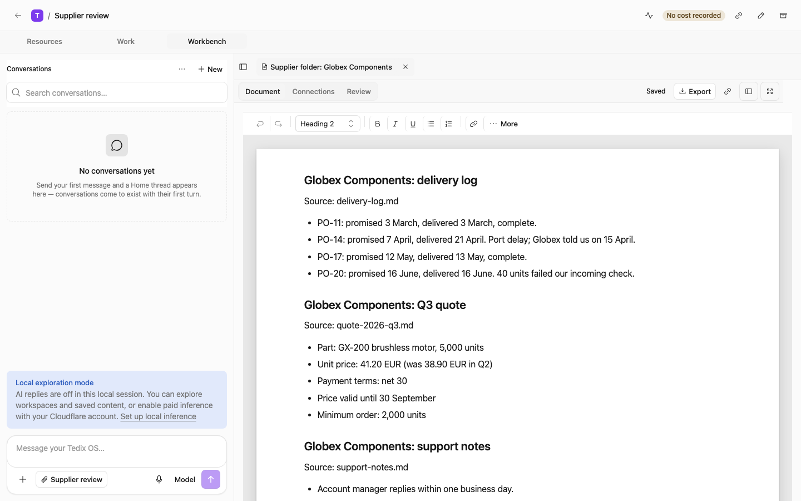

# Tedix

[](https://github.com/tedix-hq/tedix/actions/workflows/oss-public-ci.yml)
[](docs/public/release-status.md)

**Agents you can hold accountable.**

[Website](https://tedix.dev) · [Docs](https://docs.tedix.dev) ·
[Discussions](https://github.com/tedix-hq/tedix/discussions)

Tedix runs long-lived AI workers, called **tedis**, inside your organization.
Each tedi has its own identity, scoped tools, a budget, and approval rules, and
Tedix keeps a record of every run: what the worker did, why, and who allowed it.

For example, give a tedi access to one supplier folder. It can write a
decision note with cited sources, draft a follow-up, and ask before sending
anything. Afterwards you can open the run and see the worker, the tools it
used, the approval, and the result.
[examples/supplier-review](examples/supplier-review) is a small version you can
run locally.



Tedix runs on Cloudflare Workers, Durable Objects, Workflows, D1, and R2. This
repository is the whole product and the source Tedix Cloud is built from;
`main` is the source line. Tedix is in beta:
[Release status](docs/public/release-status.md) lists what is available today.

## Try Tedix Cloud

Tedix Cloud is the managed service, in an invited beta. To get access, ask
through the [contact page](https://tedix.dev/contact/). With access:

```sh
curl -fsSL https://downloads.tedix.dev/install.sh | sh
tedix login
```

Then follow [Connect to Tedix Cloud](docs/public/learning-paths/first-connection.md)
to verify the saved profile and live gateway before running a worker.

## Run it locally

You need Git, Bun, and Node.js 22+ (real Node, not a Bun shim). No account or
cloud credentials are needed.

```sh
git clone https://github.com/tedix-hq/tedix.git && cd tedix
bun run-local
```

The launcher installs dependencies, starts the API, database, and web app on
your machine, and prints `Tedix OS: http://localhost:3030`. Open it and name
your local organization; Tedix creates the organization, your owner account,
and a first tedi. Data stays in `.wrangler/run-local`.

Local mode makes no model calls by default. To turn on model turns through
Workers AI on your own paid Cloudflare account:

```sh
bunx wrangler login && bunx wrangler whoami   # note your account id
bun run-local --inference --workers-ai-account=<account-id>
```

`bun run-local --smoke` checks onboarding and exits; `--demo` loads sample data.
See [Getting started](docs/public/getting-started.md) for the full walkthrough.

## What is in the repository

- **tedis**: workers whose identity, memory, skills, and policies outlive any
  single run.
- **Home**: the conversation where you ask for work. Tedix answers directly or
  hands the request to a tedi, and saves each turn as a run you can open.
- **Work Items and approvals**: bounded outcomes with an owner, a risk level,
  and a budget. Nobody approves their own request.
- **MCP app platform**: tools and widgets defined as configuration rather than
  one handler per tool.
- **Tedix OS, CLI, CMS, and docs sites**: the whole product, not a reduced
  community edition.

[Core concepts](docs/public/concepts.md) defines these terms.

## Find your way around

| Work on                 | Start here                                                                                         |
| ----------------------- | -------------------------------------------------------------------------------------------------- |
| A screen                | [apps/os](apps/os)                                                                                 |
| An API or stored record | [packages/api-contract](packages/api-contract) → [apps/api](apps/api) → [packages/db](packages/db) |
| Worker execution        | [apps/tedi-runtime](apps/tedi-runtime)                                                             |
| A tool or integration   | [apps/mcp](apps/mcp) and the [MCP app platform](docs/public/mcp-app-platform.md)                   |
| The CLI                 | [packages/cli](packages/cli)                                                                       |
| Websites                | [apps/cms](apps/cms) and the [CMS guide](docs/public/cms.md)                                       |

[One request through Tedix](docs/public/cloudflare-architecture.md#one-request-through-tedix)
traces a request from the CLI through routing to the next turn. The
[engineering docs](docs/ENGINEERING.md) cover architecture, data, MCP, and the
worker runtime. Read [AGENTS.md](AGENTS.md) and the nearest scoped guide before
editing; `bun run verify` runs the same checks as the pre-push hook.

## Contributing, support, and security

Issues and ideas are welcome; maintainers write the code
([Contributing](CONTRIBUTING.md), which also covers support, governance, the
code of conduct, and releases). Report vulnerabilities through
[Security](SECURITY.md). See also [Trademarks](TRADEMARKS.md).

Community: ask questions and share what you build in
[GitHub Discussions](https://github.com/tedix-hq/tedix/discussions).

Telemetry: the CLI sends no analytics, telemetry, or crash reports. See
[Telemetry and network contact](docs/public/telemetry.md) for what Tedix Cloud
and the opt-in plugin hooks send.

## News

Newest first. Each entry is a date and one or two plain sentences.

- **2026-10-07**: The Tedix plugin restarted at version 0.1.0 and is now
  versioned independently of the CLI.
- **2026-10-06**: The source is public on GitHub, with the first source
  prerelease,
  [v0.1.0-beta.1](https://github.com/tedix-hq/tedix/releases/tag/v0.1.0-beta.1).

## Licensing

Each workspace declares its license in its `package.json`.

| License       | Workspaces                                                                                                                                                                         |
| ------------- | ---------------------------------------------------------------------------------------------------------------------------------------------------------------------------------- |
| AGPL-3.0-only | [LICENSE](LICENSE): every `apps/*` app and all other `packages/*`                                                                                                                  |
| Apache-2.0    | `packages/`: `api-client`, `api-contract`, `context-core`, `installation-manifest`, `mcp`, `mcp-client-core`, `ssrf-guard`, `tedi-codemode-core`, `tenant-directory`, `worker-kit` |
| MIT           | `packages/`: `design-tokens`, `tsconfig`, `webmcp-core`, `widget-i18n`, `widget-ui`; `apps/cms/templates/*`                                                                        |

Details: [Licensing](docs/public/licensing.md) and
[Third-Party Notices](THIRD_PARTY_NOTICES.md).
