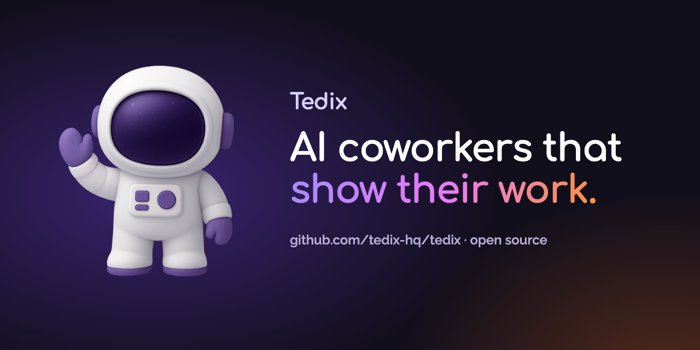

<h1 align="center">Tedix</h1>

<p align="center">
  
</p>

<p align="center">
  <a href="docs/public/release-status.md"></a>
  <a href="docs/public/licensing.md"></a>
  <a href="https://github.com/tedix-hq/tedix/stargazers"></a>
</p>

<p align="center">
  <a href="https://tedix.dev">Website</a> ·
  <a href="https://docs.tedix.dev">Docs</a> ·
  <a href="https://github.com/tedix-hq/tedix/discussions">Discussions</a>
</p>

Tedix gives your team AI coworkers, called **tedis**, for recurring work. They
ask before risky steps, and every run leaves a record: what the tedi did, which
tools it used, and who approved it.

If a chatbot is a smart intern you have to watch, a tedi is a teammate with a
job, a budget and a paper trail.


_A tedi reviews one supplier folder, writes a decision note with cited sources,
and asks before sending anything. Run the small version in
[examples/supplier-review](examples/supplier-review)._

## How it works

| Step                              | What happens                                                                                                            |
| --------------------------------- | ----------------------------------------------------------------------------------------------------------------------- |
| **1. Give it a job**              | Ask in Home. Tedix answers directly or hands the request to a tedi with its own memory, skills and policies.            |
| **2. It asks before risky steps** | Work Items carry an owner, a risk level and a budget. Risky steps wait for approval; nobody approves their own request. |
| **3. Open the record**            | Every run is saved: the worker, the tools it used, the approval and the result.                                         |

## Quick start

### Run it locally

You need Git, Bun, and Node.js 22+ (real Node, not a Bun shim). No account or
cloud credentials are needed.

```sh
git clone https://github.com/tedix-hq/tedix.git && cd tedix
bun run-local
```

The launcher starts the API, database, and web app and prints
`Tedix OS: http://localhost:3030`. Open it and name your local organization;
Tedix creates the organization, your owner account, and a first tedi. Data
stays in `.wrangler/run-local`.

Local mode makes no model calls by default. To turn on model turns through
Workers AI on your own paid Cloudflare account:

```sh
bunx wrangler login && bunx wrangler whoami   # note your account id
bun run-local --inference --workers-ai-account=<account-id>
```

`--smoke` checks onboarding and exits; `--demo` loads sample data. See
[Getting started](docs/public/getting-started.md).

### Tedix Cloud (invited beta)

Ask for access through the [contact page](https://tedix.dev/contact/). With
access:

```sh
curl -fsSL https://downloads.tedix.dev/install.sh | sh
tedix login
```

Then follow [Connect to Tedix Cloud](docs/public/learning-paths/first-connection.md).

## Works with

- **Claude** (chat, Cowork and Claude Code), **ChatGPT Work** and **Codex**
  through the [Tedix plugin](plugins/tedix/README.md).
- Other MCP-compatible clients through the
  [MCP gateway](docs/public/mcp-app-platform.md).
- Built on Cloudflare Workers, Durable Objects, Workflows, D1, and R2.

## Who it's for

✅ You run AI agents but can't tell whether they really finished.<br>
✅ You need a human to approve before an agent touches money, customers or production.<br>
✅ You want recurring work done without babysitting it.

## Docs and concepts

This repository is the whole product and the source Tedix Cloud is built from.
[Core concepts](docs/public/concepts.md) defines tedis, Home, Work Items and
the MCP app platform; [Release status](docs/public/release-status.md) lists
what is available today.

## Community, contributing and security

Ask questions and share what you build in
[GitHub Discussions](https://github.com/tedix-hq/tedix/discussions). Issues and
ideas are welcome; maintainers write the code ([Contributing](CONTRIBUTING.md)).
Report vulnerabilities through [Security](SECURITY.md). See also
[Trademarks](TRADEMARKS.md).

The CLI sends no telemetry; see [Telemetry and network contact](docs/public/telemetry.md).

## News

- **2026-10-07**: The Tedix plugin restarted at version 0.1.0 and is now
  versioned independently of the CLI.
- **2026-10-06**: The source is public on GitHub, with the first source
  prerelease,
  [v0.1.0-beta.1](https://github.com/tedix-hq/tedix/releases/tag/v0.1.0-beta.1).

## License

Mostly AGPL-3.0; some packages are Apache-2.0 or MIT. See
[Licensing](docs/public/licensing.md) and
[Third-Party Notices](THIRD_PARTY_NOTICES.md).
